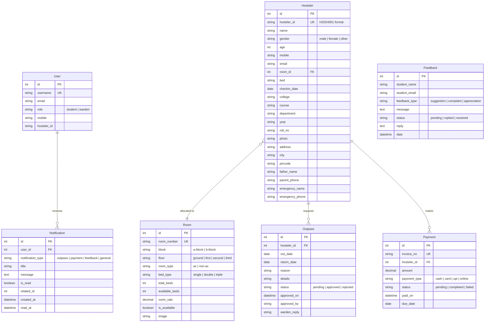

<


[Features](#-key-features) · [Architecture](#-system-architecture) · [API Docs](#-api-documentation) · [Setup](#-setup-instructions) · [Database](#-database-schema) · [Security](#-security-analysis) · [Roadmap](#-future-roadmap)

</div>

---

## 📋 Table of Contents

1. [Overview](#-overview)
2. [Problem Statement](#-problem-statement)
3. [Solution](#-solution)
4. [Key Features](#-key-features)
5. [Module Breakdown](#-module-breakdown)
6. [Screens Overview](#-screens-overview)
7. [Technology Stack](#-technology-stack)
8. [System Architecture](#-system-architecture)
9. [Database Schema](#-database-schema)
10. [API Documentation](#-api-documentation)
11. [Setup Instructions](#-setup-instructions)
12. [Environment Variables](#-environment-variables)
13. [Demo Mode](#-demo-mode)
14. [Security Analysis](#-security-analysis)
15. [Performance & Scalability](#-performance--scalability-analysis)
16. [Debugging Guide](#-debugging-guide)
17. [Future Roadmap](#-future-roadmap)
18. [Production Deployment](#-production-deployment-guide)
19. [Folder Structure](#-folder-structure)
20. [Contributing](#-contributing)
21. [License](#-license)
22. [Credits](#-credits)

---

## 🔍 Overview

**Smart Hostel 360** is an end-to-end hostel management platform that digitizes every aspect of on-campus student accommodation — from application intake and room allocation through fee collection, outpass approval, complaint management, and warden dashboards.

The system implements a **decoupled frontend–backend architecture** with a resilient **LocalStorage fallback** strategy, allowing the frontend to operate in full demo mode without a running Django server.

---

## ❗ Problem Statement

Traditional hostel management relies on manual registers, paper-based outpass slips, in-person fee collection, and verbal complaint resolution. This leads to:

- **Data fragmentation** across ledgers, spreadsheets, and verbal logs
- **Delayed approvals** for outpasses and room changes
- **No transparency** for students regarding payment history or request status
- **Zero analytics** for wardens to monitor occupancy, revenue, or trends
- **Security blind spots** with no audit trail for decisions

---

## ✅ Solution

Smart Hostel 360 replaces every manual process with a digital workflow:

| Manual Process | Digital Replacement |
|---|---|
| Paper outpass slips | Outpass request → warden approval → receipt download |
| Cash-only fee collection | UPI / Card / Cash payment with generated receipts |
| Notice board announcements | Broadcast notification system with badge alerts |
| Verbal complaints | Anonymous complaint box with warden reply thread |
| Room allocation ledger | Automated gender-aware room allocation algorithm |
| Paper registration forms | Multi-step digital registration with photo upload |

---

## ⭐ Key Features

### 🔐 Authentication & Access
- **Dual-role login** — Student and Warden modules with distinct UI flows
- **JWT-based authentication** (backend) with `access` + `refresh` tokens
- **Role-based menu visibility** — warden-only menus hidden for students
- **Application form** generates login credentials on submission

### 🏠 Room Management
- **CRUD operations** for rooms (create, update, delete, list)
- **Automatic bed allocation** with gender-aware filtering (Boys Block A / Girls Block B)
- **Occupancy tracking** with real-time available bed count
- **Room cards** with type badges (AC/Non-AC, Single/Double/Triple)
- **Occupancy progress bars** showing fill percentage

### 📄 Outpass System
- **Student request** with date range, reason, and extract-leave toggle
- **Warden approval/rejection** with reply messages
- **Receipt generation** as downloadable HTML documents
- **Status lifecycle**: `pending` → `approved` | `rejected` → `completed`
- **Search & filter** by status and student ID

### 💳 Payment Processing
- **Multi-method support**: UPI, Card (masked storage), Cash
- **Receipt generation** with downloadable HTML invoices
- **CSV export** for financial reconciliation
- **Payment history** per student with amount, method, and timestamps
- **Warden notification** on each payment received

### 📢 Notification System
- **Warden broadcast** — send notifications visible to all students
- **Student notification view** with badge counter and session-based read tracking
- **Warden inbox** — aggregated feed of all system events (payments, outpasses)
- **Delete capability** for wardens to manage notification history

### 📝 Complaint & Feedback
- **Anonymous complaint box** — student IDs are masked (`HS001XXX987`)
- **Warden reply threads** on each complaint with timestamps
- **Feedback system** with categorization: Suggestion, Complaint, Appreciation
- **Status tracking**: `pending` → `replied` → `resolved`

### 📊 Dashboard & Reporting
- **Dashboard statistics** — Total students, available rooms, occupied rooms, pending outpasses
- **Recent activity feed** — latest registrations and outpass requests
- **Warden dashboard** with dedicated stat cards and chart placeholders
- **Dynamic report generation** with table rendering for all entities
- **Student information cards** with click-to-expand modal profiles

### 📝 Registration
- **Multi-step form** (3 steps: Personal → Academic → Parent Details)
- **Step indicators** with progress visualization
- **Photo upload** with preview
- **Auto-generated Hosteler ID** (format: `H2024001`)
- **Application form** on welcome page for new student intake

---

## 📦 Module Breakdown

### Frontend Modules

| Module | File | Purpose |
|---|---|---|
| **Core SPA** | `index.html` | Monolithic 4544-line SPA with inline CSS, HTML pages, and JavaScript logic |
| **Storage Utility** | `utils/storage.js` | LocalStorage CRUD abstraction layer (`StorageUtils`) |
| **Data Initializer** | `js/data-init.js` | Preloads 8 sample students + 4 rooms for demo mode |
| **Notification System** | `js/notifications.js` | Warden broadcast, student view, badge system, session tracking |
| **Outpass System** | `pages/outpass.js` | Outpass CRUD, approval workflow, receipt generation |
| **Payment System** | `pages/payments.js` | Payment processing (UPI/Card/Cash), receipt gen, CSV export |
| **Complaint System** | `pages/complaint.js` | Anonymous complaint submission, warden reply threads |
| **Warden Inbox** | `pages/warden_inbox.js` | Warden notification aggregation and rendering |
| **Verification Suite** | `pages/verify.js` | Automated acceptance tests for all modules |
| **3D Animations** | `css/animations-3d.css` | CSS3 3D transforms, perspective effects, hover animations |
| **Notification Styles** | `css/notifications.css` | Dedicated styles for notification cards and badges |

### Backend Django Apps

| App | Purpose | Key Model |
|---|---|---|
| **accounts** | JWT auth, login, user profiles | `User` (extends `AbstractUser`) |
| **hostel** | Hosteler CRUD | `Hosteler` (FK → `Room`) |
| **rooms** | Room CRUD, bed allocation/deallocation | `Room` |
| **outpass** | Outpass CRUD, approval workflow | `Outpass` (FK → `Hosteler`) |
| **payments** | Payment CRUD | `Payment` (FK → `Hosteler`) |
| **feedback** | Feedback CRUD with reply | `Feedback` |
| **notifications** | System notifications | `Notification` (FK → `User`) |
| **core** | Shared utilities | `CamelCaseModelSerializer`, custom permissions |

---

## 🖥 Screens Overview

| # | Screen | Role | Description |
|---|---|---|---|
| 1 | **Welcome Page** | Public | Hero section, feature showcase, testimonials, application CTA |
| 2 | **Application Form** | Public | New student intake with auto-credential generation |
| 3 | **Login** | Public | Dual-module login (Student / Warden tab selection) |
| 4 | **Dashboard** | Both | Statistics cards, recent activity feeds, navigation grid |
| 5 | **Registration** | Warden | 3-step form: Personal → Academic → Parent details |
| 6 | **Room Booking** | Both | Available rooms grid, booking summary, confirmation receipt |
| 7 | **Room Management** | Warden | CRUD interface for room inventory |
| 8 | **Boys/Girls Allocation** | Warden | Gender-segregated room allocation views |
| 9 | **Hosteler Information** | Both | Student cards grid with search + modal detail view |
| 10 | **Living Hostelers** | Both | Currently residing hostelers list |
| 11 | **Outpass** | Both | Request form (student) / Approval queue (warden) |
| 12 | **Payments** | Both | Payment form, history table, CSV export |
| 13 | **Complaint Box** | Student | Anonymous complaint submission |
| 14 | **Feedback** | Both | Feedback form + list with warden reply |
| 15 | **Reports** | Both | Dynamic table generation for all entity types |
| 16 | **Notifications** | Both | Warden: broadcast + delete / Student: view + badge |
| 17 | **Warden Dashboard** | Warden | Dedicated stats, charts, management tools |
| 18 | **Warden Inbox** | Warden | Aggregated payment + outpass event feed |
| 19 | **Verification** | Dev | Automated acceptance test runner (12 tests) |
| 20 | **About / Features / Contact** | Both | Static informational pages |

---

## 🔧 Technology Stack

### Frontend

| Layer | Technology | Details |
|---|---|---|
| **Markup** | HTML5 | Semantic structure, `<section>` page containers |
| **Styling** | CSS3 | 3D transforms, `perspective`, `rotateX/Y`, glassmorphism, CSS variables, responsive grids |
| **Logic** | Vanilla JavaScript | IIFE modules, `window.*` namespace exports, `fetch()` API integration |
| **Storage** | LocalStorage | JSON-based CRUD via `StorageUtils` abstraction |
| **Icons** | Font Awesome 6.4 | CDN-loaded icon library |
| **Images** | Unsplash / Pravatar | External CDN images for backgrounds and avatars |

### Backend

| Layer | Technology | Version |
|---|---|---|
| **Framework** | Django | 5.0.1 |
| **API Layer** | Django REST Framework | 3.14.0 |
| **Authentication** | SimpleJWT | 5.3.1 |
| **Database** | MySQL | via `mysqlclient 2.2.1` |
| **CORS** | django-cors-headers | 4.3.1 |
| **Config** | python-decouple | 3.8 |
| **Image Processing** | Pillow | 10.2.0 |

---

## 🏗 System Architecture

### Architecture Type

**Decoupled Monolith with Offline-First Fallback**

```
┌─────────────────────────────────────────────────────────┐
│                    FRONTEND (Browser)                    │
│  ┌───────────────┐  ┌──────────────┐  ┌──────────────┐  │
│  │  index.html   │  │  JS Modules  │  │  CSS Styles  │  │
│  │  (4544 lines) │  │  (8 files)   │  │  (2 files)   │  │
│  └───────┬───────┘  └──────┬───────┘  └──────────────┘  │
│          │                 │                             │
│  ┌───────▼─────────────────▼───────┐                    │
│  │     State Management Layer      │                    │
│  │  ┌─────────────┐ ┌───────────┐  │                    │
│  │  │ StorageUtils│ │ hostelData│  │                    │
│  │  │ (LS CRUD)   │ │ (API Map) │  │                    │
│  │  └──────┬──────┘ └─────┬─────┘  │                    │
│  └─────────┼──────────────┼────────┘                    │
│            │              │                             │
│     ┌──────▼──────┐ ┌─────▼──────┐                      │
│     │ LocalStorage│ │  fetch()   │                      │
│     │  (Fallback) │ │  (Primary) │                      │
│     └─────────────┘ └─────┬──────┘                      │
└───────────────────────────┼─────────────────────────────┘
                            │ HTTP/REST
                            ▼
┌─────────────────────────────────────────────────────────┐
│                 BACKEND (Django + DRF)                   │
│  ┌──────────┐  ┌──────────────┐  ┌───────────────────┐  │
│  │ JWT Auth │  │  ViewSets    │  │  Custom Perms     │  │
│  │ SimpleJWT│  │  (ModelCRUD) │  │  IsWarden/ReadOnly│  │
│  └─────┬────┘  └──────┬───────┘  └─────────┬─────────┘  │
│        │              │                    │             │
│  ┌─────▼──────────────▼────────────────────▼──────────┐  │
│  │              CamelCase Serializer Layer             │  │
│  │         (snake_case ↔ camelCase transform)          │  │
│  └─────────────────────┬──────────────────────────────┘  │
│                        │                                 │
│  ┌─────────────────────▼──────────────────────────────┐  │
│  │                   MySQL Database                    │  │
│  │  users | hostelers | rooms | outpasses | payments   │  │
│  │  feedback | notifications                          │  │
│  └────────────────────────────────────────────────────┘  │
└─────────────────────────────────────────────────────────┘
```

### Communication Pattern

```
Frontend ──fetch()──▶ GET /api/hostel-data/ ──▶ HostelDataView
                                                    │
                              ┌──────────────────────┤
                              ▼                      ▼
                    HostelerSerializer        RoomSerializer
                    OutpassSerializer         PaymentSerializer
                    FeedbackSerializer
                              │
                              ▼
                    Aggregated JSON Response ──▶ window.hostelData
```

### Data Synchronization Strategy

1. **Primary**: Frontend calls `GET /api/hostel-data/` on login → populates `window.hostelData`
2. **Fallback**: If API unreachable, `StorageUtils` reads from `localStorage` keys
3. **Demo Mode**: `data-init.js` seeds 8 students + 4 rooms into LocalStorage on first load
4. **Write Path**: Mutations go to both API (`fetch POST/PUT`) and LocalStorage simultaneously

### State Management

- **No framework-level state management** (no Redux, MobX, etc.)
- Global `window.hostelData` object acts as in-memory cache
- `StorageUtils` provides persistent storage layer
- Page state managed via CSS class toggling (`.page.active`)
- Form state managed via DOM `value` properties

---

## 🗄 Database Schema

### Entity-Relationship Diagram



### Key Relationships

| Relationship | Type | Constraint |
|---|---|---|
| `Hosteler` → `Room` | Many-to-One | `SET_NULL` on delete |
| `Outpass` → `Hosteler` | Many-to-One | `CASCADE` on delete |
| `Payment` → `Hosteler` | Many-to-One | `CASCADE` on delete |
| `Notification` → `User` | Many-to-One | `CASCADE` on delete |
| `Room` ← `Hosteler` | One-to-Many | `related_name='hostelers'` |

### Validation Requirements

- `room_number`: Unique, max 10 chars
- `hosteler_id`: Unique, `H2024XXX` format
- `invoice_no`: Unique, max 20 chars
- `total_beds`: Range 1–10
- `available_beds`: 0 ≤ value ≤ `total_beds`
- `email`: Django `EmailField` validation
- `mobile`: Max 15 chars
- `status` fields: Enforced via `choices` tuples

---

## 📡 API Documentation

### Base URL

```
http://127.0.0.1:8000/api/
```

### Authentication

All endpoints (except login) require JWT Bearer token:

```http
Authorization: Bearer <access_token>
```

---

### 🔑 Auth Endpoints

#### POST `/api/auth/login/`

**Login and receive JWT tokens.**

| Parameter | Type | Required | Description |
|---|---|---|---|
| `username` | string | ✅ | User's username |
| `password` | string | ✅ | User's password |

**Request:**
```json
{
    "username": "warden1",
    "password": "secure_password"
}
```

**Response (200):**
```json
{
    "access": "eyJhbGciOiJIUzI1NiIsInR...",
    "refresh": "eyJhbGciOiJIUzI1NiIsInR...",
    "user": {
        "id": 1,
        "username": "warden1",
        "email": "warden@hostel.edu",
        "first_name": "Admin",
        "last_name": "Warden",
        "role": "warden",
        "mobile": "9876543210",
        "hosteler_id": ""
    }
}
```

**Error (400):**
```json
{
    "non_field_errors": ["Invalid credentials"]
}
```

#### GET `/api/auth/profile/`

**Get authenticated user's profile.** Requires: `IsAuthenticated`

**Response (200):**
```json
{
    "id": 1,
    "username": "warden1",
    "email": "warden@hostel.edu",
    "role": "warden",
    "mobile": "9876543210",
    "hosteler_id": ""
}
```

#### POST `/api/auth/token/refresh/`

**Refresh an expired access token.**

**Request:**
```json
{ "refresh": "eyJhbGciOiJIUzI1NiIsInR..." }
```

**Response (200):**
```json
{ "access": "eyJhbGciOiJIUzI1NiIsInR..." }
```

---

### 📊 Aggregate Endpoint

#### GET `/api/hostel-data/`

**Returns all hostel data in a single response.** Requires: `IsAuthenticated`

This is the central data endpoint the frontend consumes on login.

**Response (200):**
```json
{
    "hostelers": [ ... ],
    "rooms": [ ... ],
    "outpasses": [ ... ],
    "bookings": [],
    "payments": [ ... ],
    "maintenance": [],
    "inventory": [],
    "feedback": [ ... ]
}
```

---

### 👤 Hostelers

| Method | Endpoint | Permission | Description |
|---|---|---|---|
| `GET` | `/api/hostelers/` | Authenticated | List all hostelers (students see only self) |
| `POST` | `/api/hostelers/` | Warden | Create hosteler |
| `GET` | `/api/hostelers/{id}/` | Authenticated | Retrieve hosteler |
| `PUT` | `/api/hostelers/{id}/` | Warden | Full update |
| `PATCH` | `/api/hostelers/{id}/` | Warden | Partial update |
| `DELETE` | `/api/hostelers/{id}/` | Warden | Delete hosteler |

**Sample Hosteler Object (camelCase):**
```json
{
    "id": 1,
    "hostelerId": "H2024001",
    "name": "Alice Kumar",
    "gender": "female",
    "age": 20,
    "mobile": "9876543210",
    "email": "alice@example.com",
    "room": 3,
    "bed": "A",
    "checkinDate": "2024-07-15",
    "college": "ABC Engineering College",
    "course": "Computer Science",
    "students": []
}
```

---

### 🏠 Rooms

| Method | Endpoint | Permission | Description |
|---|---|---|---|
| `GET` | `/api/rooms/` | Authenticated | List all rooms |
| `POST` | `/api/rooms/` | Warden | Create room |
| `GET` | `/api/rooms/{id}/` | Authenticated | Retrieve room |
| `PUT` | `/api/rooms/{id}/` | Warden | Full update |
| `PATCH` | `/api/rooms/{id}/` | Warden | Partial update |
| `DELETE` | `/api/rooms/{id}/` | Warden | Delete room (fails if beds allocated) |

**Sample Room Object (camelCase):**
```json
{
    "id": 1,
    "roomNumber": "A101",
    "block": "a-block",
    "floor": "first",
    "roomType": "ac",
    "bedType": "double",
    "totalBeds": 2,
    "availableBeds": 1,
    "roomRate": "2500.00",
    "isAvailable": true,
    "image": null,
    "students": ["H2024001"]
}
```

---

### 📄 Outpasses

| Method | Endpoint | Permission | Description |
|---|---|---|---|
| `GET` | `/api/outpasses/` | Authenticated | List outpasses (students see only own) |
| `POST` | `/api/outpasses/` | Authenticated | Create outpass request |
| `GET` | `/api/outpasses/{id}/` | Authenticated | Retrieve outpass |
| `PATCH` | `/api/outpasses/{id}/` | Authenticated | Partial update |
| `DELETE` | `/api/outpasses/{id}/` | Authenticated | Delete outpass |
| `POST` | `/api/outpasses/{id}/set_status/` | **Warden only** | Approve or reject |

**Set Status Request:**
```json
{
    "status": "approved",
    "warden_reply": "Approved. Please return by 6 PM."
}
```

**Sample Outpass Object:**
```json
{
    "id": 1,
    "hosteler": 3,
    "outDate": "2024-12-01",
    "returnDate": "2024-12-03",
    "reason": "home_visit",
    "details": "Going home for festival",
    "status": "pending",
    "issuedOn": "2024-11-28 10:30:00",
    "approvedOn": null,
    "approvedBy": "",
    "wardenReply": ""
}
```

---

### 💳 Payments

| Method | Endpoint | Permission | Description |
|---|---|---|---|
| `GET` | `/api/payments/` | Authenticated | List payments (students see only own) |
| `POST` | `/api/payments/` | Authenticated | Create payment |
| `GET` | `/api/payments/{id}/` | Authenticated | Retrieve payment |
| `PUT` | `/api/payments/{id}/` | Authenticated | Update payment |
| `DELETE` | `/api/payments/{id}/` | Authenticated | Delete payment |

**Sample Payment Object:**
```json
{
    "id": 1,
    "invoiceNo": "INV2024001",
    "hosteler": 3,
    "amount": "5000.00",
    "paymentType": "upi",
    "status": "completed",
    "paidOn": "2024-11-15 14:30:00",
    "dueDate": "2024-11-30"
}
```

---

### 💬 Feedback

| Method | Endpoint | Permission | Description |
|---|---|---|---|
| `GET` | `/api/feedback/` | Authenticated | List all feedback |
| `POST` | `/api/feedback/` | Authenticated | Submit feedback |
| `PATCH` | `/api/feedback/{id}/` | Warden | Reply to feedback |
| `DELETE` | `/api/feedback/{id}/` | Warden | Delete feedback |

**Sample Feedback Object:**
```json
{
    "id": 1,
    "studentName": "Alice Kumar",
    "studentEmail": "alice@example.com",
    "feedbackType": "suggestion",
    "message": "Please extend library hours",
    "status": "replied",
    "reply": "We will extend hours to 11 PM starting next week.",
    "date": "2024-11-20 09:15:00"
}
```

---

### 🔔 Notifications

| Method | Endpoint | Permission | Description |
|---|---|---|---|
| `GET` | `/api/notifications/` | Authenticated | List user's notifications |
| `POST` | `/api/notifications/` | Authenticated | Create notification |
| `POST` | `/api/notifications/{id}/mark_read/` | Authenticated | Mark as read |

---

## 🚀 Setup Instructions

### Prerequisites

- **Python** 3.10+
- **MySQL** 8.0+
- **Node.js** (optional, for Live Server)
- **Git**

### Backend Setup

```bash
# 1. Clone the repository
git clone https://github.com/your-username/SmartHostel-360.git
cd SmartHostel-360/backend

# 2. Create virtual environment
python -m venv venv

# Windows
venv\Scripts\activate

# macOS/Linux
source venv/bin/activate

# 3. Install dependencies
pip install -r requirements.txt

# 4. Create MySQL database
mysql -u root -p -e "CREATE DATABASE hostel_db CHARACTER SET utf8mb4 COLLATE utf8mb4_unicode_ci;"

# 5. Configure environment
cp .env.example .env
# Edit .env with your database credentials

# 6. Run migrations
python manage.py makemigrations
python manage.py migrate

# 7. Create superuser (warden)
python manage.py createsuperuser

# 8. Start development server
python manage.py runserver
```

### Frontend Setup

```bash
# Option 1: VS Code Live Server (recommended)
# Open index.html in VS Code → Right-click → "Open with Live Server"
# Runs at http://127.0.0.1:5500

# Option 2: Python HTTP server
cd SmartHostel-360
python -m http.server 5500

# Option 3: Direct file opening
# Open index.html directly in browser (demo mode only)
```

> **Note**: The frontend works standalone in demo mode (LocalStorage). Backend is required only for persistent, multi-user data.

---

## 🔐 Environment Variables

Create a `.env` file in the `backend/` directory:

```env
SECRET_KEY=your-secret-key-here-change-in-production
DEBUG=True
DATABASE_NAME=hostel_db
DATABASE_USER=root
DATABASE_PASSWORD=your_password
DATABASE_HOST=localhost
DATABASE_PORT=3306
ALLOWED_HOSTS=localhost,127.0.0.1
CORS_ALLOWED_ORIGINS=http://127.0.0.1:5500,http://localhost:5500
```

| Variable | Description | Default |
|---|---|---|
| `SECRET_KEY` | Django cryptographic key | Insecure default (change!) |
| `DEBUG` | Enable debug mode | `True` |
| `DATABASE_NAME` | MySQL database name | `hostel_db` |
| `DATABASE_USER` | MySQL username | `root` |
| `DATABASE_PASSWORD` | MySQL password | (empty) |
| `DATABASE_HOST` | MySQL host | `localhost` |
| `DATABASE_PORT` | MySQL port | `3306` |
| `ALLOWED_HOSTS` | Django allowed hosts | `localhost,127.0.0.1` |
| `CORS_ALLOWED_ORIGINS` | CORS whitelist | `http://127.0.0.1:5500` |

---

## 🎮 Demo Mode

Smart Hostel 360 includes a fully functional **demo mode** that operates without a backend:

### How It Works

1. `data-init.js` checks if `StorageUtils` is available
2. If LocalStorage is empty, seeds **8 sample students** and **4 sample rooms**
3. `notifications.js` creates **3 demo notifications** on first load
4. All CRUD operations fall back to `StorageUtils` when API calls fail
5. Student IDs (`S001`–`S008`) and Room IDs (`R101`, `R102`, `R201`, `R202`) are deterministic

### Demo Credentials (Frontend-only)

The frontend login uses hardcoded credential validation in the inline JavaScript:

| Role | Username | Password |
|---|---|---|
| Warden | `admin` | `admin123` |
| Student | `student` | `student123` |

### Limitations of Demo Mode

- Data is **per-browser**, not shared across devices
- LocalStorage has a **~5MB limit** per origin
- No concurrent user support
- Blob URLs for receipts are **session-scoped** (lost on page refresh)

---

## 🔒 Security Analysis

### ⚠️ Critical Issues

| # | Issue | Severity | Location | Description |
|---|---|---|---|---|
| 1 | **Hardcoded credentials** | 🔴 Critical | `index.html` inline JS | `admin/admin123` and `student/student123` hardcoded in login function |
| 2 | **No password hashing (frontend)** | 🔴 Critical | `index.html` | Frontend compares plain-text passwords directly |
| 3 | **LocalStorage tampering** | 🟡 Medium | `utils/storage.js` | Any user can modify LocalStorage via browser DevTools to escalate privileges |
| 4 | **Role bypass vulnerability** | 🟡 Medium | `index.html` | Role is stored client-side; manipulating `user-type` select or JS grants warden access |
| 5 | **Password in `.env.example`** | 🟡 Medium | `backend/.env.example` | Database password `raja12345` committed to VCS |
| 6 | **Insecure default `SECRET_KEY`** | 🟡 Medium | `settings.py` | Ships with `django-insecure-change-this-in-production` |
| 7 | **No CSRF protection (frontend)** | 🟠 Low | Frontend `fetch()` | No CSRF token sent with API requests (mitigated by JWT) |
| 8 | **No rate limiting** | 🟠 Low | Backend views | Login endpoint has no brute-force protection |

### ✅ Recommended Fixes

```diff
# 1. Remove hardcoded credentials — authenticate via backend JWT only
- if (username === 'admin' && password === 'admin123') { ... }
+ const response = await fetch('/api/auth/login/', { method: 'POST', body: JSON.stringify({username, password}) });

# 2. Store JWT tokens in HttpOnly cookies instead of LocalStorage
- localStorage.setItem('access_token', data.access);
+ // Backend sets HttpOnly Secure cookie

# 3. Add rate limiting
+ pip install django-ratelimit
+ @ratelimit(key='ip', rate='5/m', method='POST')
+ def post(self, request): ...

# 4. Remove password from .env.example
- DATABASE_PASSWORD=raja12345
+ DATABASE_PASSWORD=your_secure_password_here

# 5. Add Django's security middleware for production
+ SECURE_SSL_REDIRECT = True
+ SESSION_COOKIE_SECURE = True
+ CSRF_COOKIE_SECURE = True
+ SECURE_BROWSER_XSS_FILTER = True
+ SECURE_CONTENT_TYPE_NOSNIFF = True
```

---

## ⚡ Performance & Scalability Analysis

### Current Bottlenecks

| Area | Issue | Impact |
|---|---|---|
| **`/api/hostel-data/`** | Loads ALL hostelers, rooms, outpasses, payments, feedback in one request | Response size grows linearly; >1000 records causes >5s load times |
| **No pagination (frontend)** | All entities rendered in DOM at once | Browser lag with >100 student cards |
| **Blob URLs for receipts** | Created via `URL.createObjectURL()` | Memory leaks if not revoked; lost on page refresh |
| **No database indexing** | Only default PK indexes defined | Slow queries on `hosteler_id`, `status`, `invoice_no` lookups |
| **No caching** | Every page load hits database | Unnecessary DB load for static data like room inventory |
| **Single monolithic HTML** | 4544-line single file | Long initial parse time, cannot lazy-load modules |

### Recommended Improvements

1. **Pagination**: Add `?page=1&page_size=20` params to all list endpoints (DRF pagination already configured but `PAGE_SIZE=100`)
2. **Database Indexes**:
   ```python
   class Meta:
       indexes = [
           models.Index(fields=['hosteler_id']),
           models.Index(fields=['status']),
           models.Index(fields=['invoice_no']),
       ]
   ```
3. **Redis Caching**: Cache room availability, dashboard stats
4. **WebSocket Notifications**: Replace polling with Django Channels for real-time outpass updates
5. **Lazy Loading**: Split `index.html` into component files loaded on demand
6. **CDN**: Serve static assets via CloudFront / Cloudflare
7. **Async Processing**: Use Celery for receipt PDF generation, email notifications

---

## 🐛 Debugging Guide

### Black Screen on Load

**Symptom**: Browser shows blank/black page.

**Causes & Fixes**:

1. **CSS body background covers content** — The `body` has a dark gradient overlay. Check if JavaScript fails to add `.active` class to the welcome page.
   ```javascript
   // Verify in console:
   document.getElementById('welcome').classList.contains('active')
   ```
2. **JavaScript error blocks execution** — Open DevTools → Console. Fix any `Uncaught ReferenceError` or `SyntaxError`.

### API Not Connecting

**Symptom**: Frontend shows demo data, not backend data.

**Fixes**:

1. Verify Django server is running: `python manage.py runserver`
2. Check CORS: Ensure `http://127.0.0.1:5500` is in `CORS_ALLOWED_ORIGINS`
3. Check network tab for `401 Unauthorized` → refresh JWT token
4. Verify database connection: `python manage.py dbshell`

### CORS Error

**Symptom**: `Access-Control-Allow-Origin` error in console.

**Fix**: Add your frontend origin to `settings.py`:
```python
CORS_ALLOWED_ORIGINS = [
    'http://127.0.0.1:5500',
    'http://localhost:5500',
    'http://localhost:3000',  # Add additional origins
]
```

### `hostelData` is Undefined

**Symptom**: `TypeError: Cannot read property 'hostelers' of undefined`

**Fix**: The `hostelData` variable is populated after API call or LocalStorage load. Ensure code accessing it runs after `DOMContentLoaded`:
```javascript
document.addEventListener('DOMContentLoaded', () => {
    if (window.hostelData) { /* safe to use */ }
});
```

### `showPage()` Not Switching Pages

**Symptom**: Clicking navigation links does nothing.

**Debug**:
```javascript
// Check if function exists
typeof showPage // should be "function"

// Check if target page exists
document.getElementById('home') // should return element

// Manual test
showPage('home');
```

### DOM Null Errors

**Symptom**: `Cannot read property 'innerHTML' of null`

**Cause**: Element ID mismatch between HTML and JS. Common with dynamic IDs.

**Fix**: Always null-check before DOM manipulation:
```javascript
const el = document.getElementById('my-element');
if (el) { el.innerHTML = content; }
```

### LocalStorage Corruption

**Symptom**: JSON parse errors, unexpected `null` values.

**Fix**: Clear and reinitialize:
```javascript
// In browser console:
localStorage.clear();
location.reload(); // data-init.js will repopulate demo data
```

### JSON Parsing Error

**Symptom**: `SyntaxError: Unexpected token < in JSON`

**Cause**: API returned HTML (error page) instead of JSON.

**Fix**: Check backend logs for 500 errors. Verify endpoint URL is correct. Ensure `Content-Type: application/json` header in requests.

---

## 🚀 Future Roadmap

### Phase 1 — Security Hardening
- [ ] Remove all hardcoded credentials
- [ ] Implement backend-only authentication flow
- [ ] Add rate limiting on login endpoint
- [ ] Store JWT in HttpOnly cookies
- [ ] Add CSRF protection for state-changing operations
- [ ] Implement audit logging with `django-auditlog`

### Phase 2 — Communication
- [ ] Email notifications via SendGrid/SMTP for outpass approvals
- [ ] SMS alerts via Twilio for emergency contacts
- [ ] Real-time notifications via Django Channels WebSocket
- [ ] Push notifications via Firebase Cloud Messaging

### Phase 3 — Documents & Reports
- [ ] PDF invoice generation via `reportlab` or `weasyprint`
- [ ] Automated monthly fee summary reports
- [ ] Attendance reports with Excel export
- [ ] Room occupancy analytics with Chart.js integration

### Phase 4 — Advanced Features
- [ ] Biometric attendance integration via API
- [ ] QR code-based gate pass verification
- [ ] Digital room inventory check-in/check-out
- [ ] Mess menu management module
- [ ] Maintenance request ticketing system

### Phase 5 — DevOps & Scale
- [ ] Dockerize with `docker-compose` (Django + MySQL + Nginx)
- [ ] CI/CD pipeline via GitHub Actions
- [ ] Deploy to AWS (EC2 + RDS) or GCP (Cloud Run + Cloud SQL)
- [ ] Implement Redis caching layer
- [ ] Add Sentry for error monitoring
- [ ] Add Prometheus + Grafana for metrics

---

## 🌐 Production Deployment Guide

### Docker Deployment

```dockerfile
# Dockerfile
FROM python:3.11-slim
WORKDIR /app
COPY backend/requirements.txt .
RUN pip install --no-cache-dir -r requirements.txt gunicorn
COPY backend/ .
EXPOSE 8000
CMD ["gunicorn", "hostel_management.wsgi:application", "--bind", "0.0.0.0:8000", "--workers", "3"]
```

```yaml
# docker-compose.yml
version: '3.8'
services:
  db:
    image: mysql:8.0
    environment:
      MYSQL_ROOT_PASSWORD: ${DB_PASSWORD}
      MYSQL_DATABASE: hostel_db
    volumes:
      - mysql_data:/var/lib/mysql

  backend:
    build: .
    ports:
      - "8000:8000"
    depends_on:
      - db
    env_file: .env

  nginx:
    image: nginx:alpine
    ports:
      - "80:80"
    volumes:
      - ./frontend:/usr/share/nginx/html

volumes:
  mysql_data:
```

### Production Checklist

- [ ] Set `DEBUG=False` in `.env`
- [ ] Generate a strong `SECRET_KEY`
- [ ] Run `python manage.py collectstatic`
- [ ] Configure `ALLOWED_HOSTS` with production domain
- [ ] Set up SSL/TLS certificates (Let's Encrypt)
- [ ] Enable Django security middleware
- [ ] Configure Gunicorn with `--workers` = `(2 × CPU) + 1`
- [ ] Set up database backups (automated daily)
- [ ] Configure logging to external service
- [ ] Enable HTTP security headers

---

## 📁 Folder Structure

```
SmartHostel-360/
├── index.html                    # Main SPA (4544 lines — HTML + CSS + JS)
├── README.md                     # This file
│
├── css/
│   ├── animations-3d.css         # 3D CSS transforms & effects
│   └── notifications.css         # Notification card styles
│
├── js/
│   ├── data-init.js              # Demo data seeding (8 students, 4 rooms)
│   └── notifications.js          # Notification system logic
│
├── utils/
│   └── storage.js                # LocalStorage CRUD abstraction
│
├── pages/
│   ├── outpass.js                # Outpass system logic
│   ├── payments.js               # Payment processing logic
│   ├── payments.html             # Payments standalone page
│   ├── complaint.js              # Anonymous complaint system
│   ├── verify.js                 # Acceptance test suite
│   ├── verify.html               # Test runner page
│   ├── warden_inbox.js           # Warden notification inbox
│   ├── warden_inbox.html         # Inbox standalone page
│   ├── warden_notifications.html # Warden notifications page
│   └── student_notifications.html# Student notifications page
│
├── data/
│   └── sample_students.json      # Sample student data fixture
│
├── assets/
│   └── js/                       # Additional assets
│
└── backend/
    ├── manage.py                 # Django management script
    ├── requirements.txt          # Python dependencies
    ├── .env                      # Environment variables (gitignored)
    ├── .env.example              # Example environment template
    │
    ├── hostel_management/        # Django project config
    │   ├── settings.py           # Core settings (JWT, CORS, DB)
    │   ├── urls.py               # Root URL configuration
    │   ├── views.py              # HostelDataView aggregate endpoint
    │   └── wsgi.py               # WSGI entry point
    │
    ├── accounts/                 # Authentication app
    │   ├── models.py             # Custom User model (role field)
    │   ├── serializers.py        # Login, Token, User serializers
    │   ├── views.py              # LoginView, UserProfileView
    │   └── urls.py               # /api/auth/login/, /api/auth/profile/
    │
    ├── hostel/                   # Hosteler management app
    │   ├── models.py             # Hosteler model (30+ fields)
    │   ├── serializers.py        # HostelerSerializer (camelCase)
    │   ├── views.py              # HostelerViewSet
    │   └── urls.py               # /api/hostelers/
    │
    ├── rooms/                    # Room management app
    │   ├── models.py             # Room model (bed tracking)
    │   ├── serializers.py        # RoomSerializer with students list
    │   ├── views.py              # RoomViewSet (delete protection)
    │   └── urls.py               # /api/rooms/
    │
    ├── outpass/                  # Outpass management app
    │   ├── models.py             # Outpass model (status workflow)
    │   ├── serializers.py        # OutpassSerializer
    │   ├── views.py              # OutpassViewSet + set_status action
    │   └── urls.py               # /api/outpasses/
    │
    ├── payments/                 # Payment management app
    │   ├── models.py             # Payment model (multi-method)
    │   ├── serializers.py        # PaymentSerializer
    │   ├── views.py              # PaymentViewSet
    │   └── urls.py               # /api/payments/
    │
    ├── feedback/                 # Feedback management app
    │   ├── models.py             # Feedback model (reply support)
    │   ├── serializers.py        # FeedbackSerializer
    │   ├── views.py              # FeedbackViewSet
    │   └── urls.py               # /api/feedback/
    │
    ├── notifications/            # Notification app
    │   ├── models.py             # Notification model
    │   ├── serializers.py        # NotificationSerializer
    │   ├── views.py              # NotificationViewSet + mark_read
    │   └── urls.py               # /api/notifications/
    │
    └── core/                     # Shared utilities
        ├── serializers.py        # CamelCaseModelSerializer mixin
        └── permissions.py        # IsWarden, IsStudent, IsWardenOrReadOnly
```

---

## 🤝 Contributing

1. **Fork** the repository
2. **Create** a feature branch (`git checkout -b feature/amazing-feature`)
3. **Commit** your changes (`git commit -m 'Add amazing feature'`)
4. **Push** to the branch (`git push origin feature/amazing-feature`)
5. **Open** a Pull Request

### Development Guidelines

- Follow **PEP 8** for Python code
- Use **camelCase** for frontend JavaScript variables and functions
- Use **snake_case** for Django models and serializers
- Add **JSDoc comments** to all JavaScript functions
- Add **docstrings** to all Python classes and methods
- Write tests for new features before submitting PR

---

## 📄 License

This project is licensed under the terms specified by the project owner. See `LICENSE` file for details.

---

## 👨‍💻 Credits

**Smart Hostel 360** — Built with ❤️

| Role | Contributor |
|---|---|
| **Full-Stack Developer** | Raja Jerald |
| **UI/UX Design** | CSS3 3D animations, responsive layouts |
| **Backend Architecture** | Django + DRF + JWT + MySQL |
| **Frontend Architecture** | Vanilla JS SPA with LocalStorage fallback |

---

<div align="center">

**⭐ Star this repository if you found it helpful!**

Made with HTML5 • CSS3 • JavaScript • Django • MySQL

</div>

